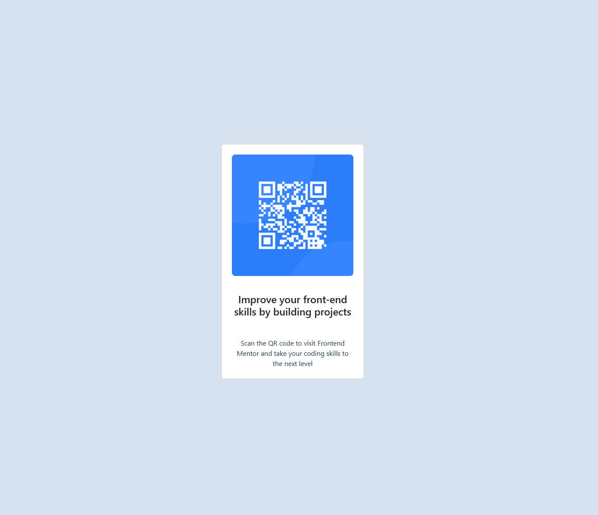

# Frontend Mentor - QR code component solution

This is a solution to the [QR code component challenge on Frontend Mentor](https://www.frontendmentor.io/challenges/qr-code-component-iux_sIO_H). Frontend Mentor challenges help you improve your coding skills by building realistic projects. 

## Table of contents

- [Overview](#overview)
  - [Screenshot](#screenshot)
  - [Links](#links)
- [My process](#my-process)
  - [Built with](#built-with)
  - [What I learned](#what-i-learned)
  - [Continued development](#continued-development)
  - [Useful resources](#useful-resources)
  - [AI Collaboration](#ai-collaboration)
- [Author](#author)
- [Acknowledgments](#acknowledgments)

## Overview

### Screenshot

### Links

- GitHub:(https://github.com/Shelley960/qr-code-component-main-bootstrap)

## My process

### Built with

- Semantic HTML5 markup
- CSS custom properties
- Flexbox
- CSS Grid
- Bootstrap
- Google Font Family

### What I learned

I learned how to link google font to the code. Bootstrap is really helped us easier to design without use less css.  I need to learn how to use their language.  I also learn how to add bootstrip on my code.  

### Continued development

I will learn more CSS libraries to help me in future which one is better to use on different situation.  I surely need to learn more Bootstrap because some utility and component classses do not seem to work.  

### Useful resources

- [Bootstrap](https://getbootstrap.com/docs/5.1/getting-started/introduction/) - This helped me understand how to use Bootstrap.  It explains to us how to use it and with exmaple.  
- [w3school](https://www.w3schools.com) - This helped me understand how to use HTML and CSS.

## Acknowledgments

Paul and Tishana helped me understand how to make the font closer.

